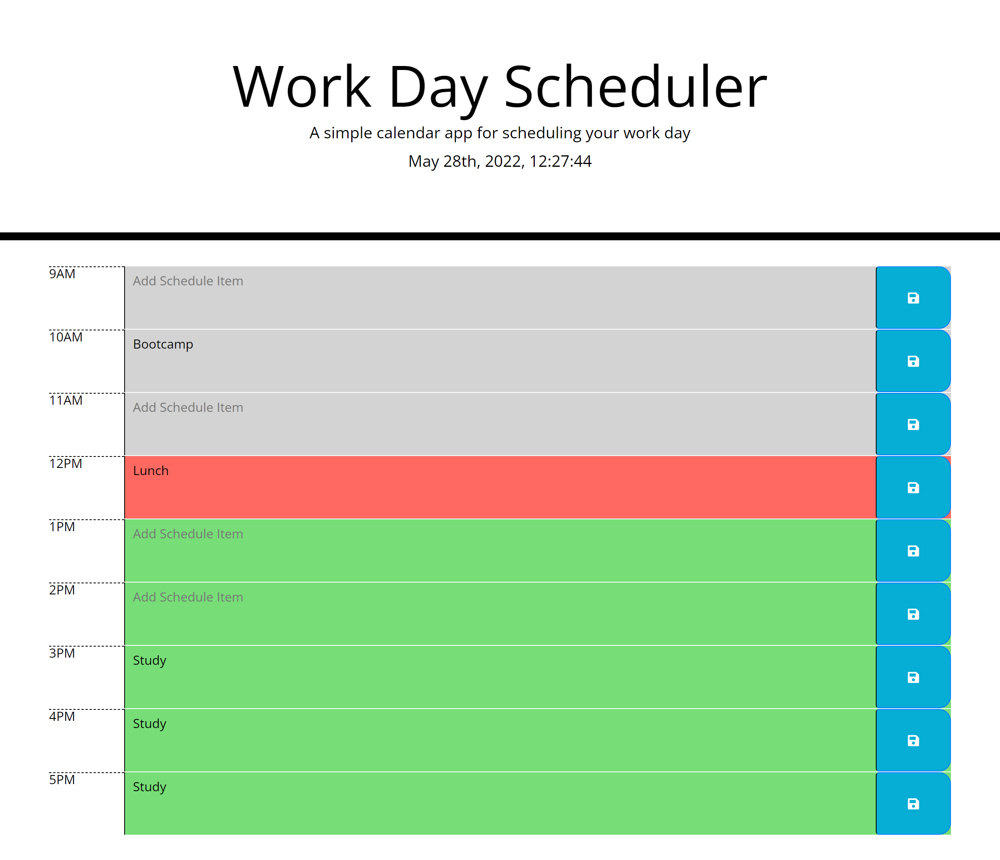

# Work Day Scheduler

## Description
This repository contains a day plan scheduler application that utilizes moment.js. This scheduler utilizes local storage to save entries to the day plan. Time slots change color depending on the current time of day. 

## Usage

This website can be accessed at https://kevinleekwlee.github.io/work-day-scheduler/

Below is a screenshot of the website. 

